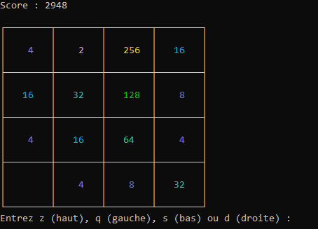

# demi le cas rend tu Hit

## Description
Jeu 2048 jouable sur terminal. bougez les tuiles avec zqsd jusqu'à atteindre la tuile 2048. a la fin du jeu (plus de place ou tuile 2048 crée), le jeu affichera votre score, calculé en fonction des tuiles que vous avez assemblées.
<br>

## Jeu
<br>
Le but de ce projet est de recréer le célèbre jeu 2048 dans le langage C en utilisant des processus différents communiquant entre eux pour réaliser les différentes fonction de jeu.
<br>

## installation et lancement
```bash
$ git clone git@git.unistra.fr:m.deazevedo/demi-le-cas-rend-tu-hit.git

$ cd demi-le-cas-rend-tu-hit/

$ make

$ cd bin/

$ ./demi_le_cas 
```
<br>

## Contributions
Abel GOMES : Communication entre les processus, déroulement de la partie<br>
Lucie TRIPIER : Fonctions de jeu, affichage<br>
Mathis DE AZEVEDO : Fonctions de jeu, interactions avec l'utilisateur<br>

## License
MIT License<br>